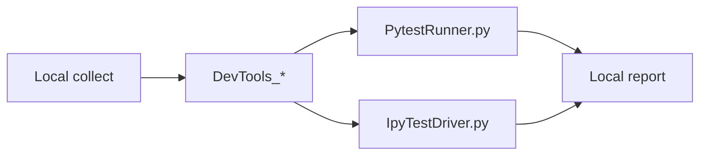

# AGENTS

## Overview

pytest client plugin for [RevitDevTool](https://github.com/trgiangv/RevitDevTool). Collects tests locally, executes them inside a live host via Named Pipe JSON-RPC (`BridgeMessage` framing).

**Supported today:** **Revit** and **AutoCAD family** (AutoCAD, Civil 3D, Plant 3D, Architecture / Mechanical / MEP / Electrical / Map 3D). Other hosts may appear in the registry but are **in progress** — not validated end-to-end yet.

**Package:** `revitdevtool_pytest` (PyPI) · **Entry point:** `revitdevtool` · **Version:** see `pyproject.toml`

## Architecture



Do **not** connect to `DevToolsMcp_*` (MCP SDK). Pytest uses `DevTools_{Host}_{Version}_{PID}` on `DevToolsPipeServer`.

### Client modules (`src/revitdevtool_pytest/`)

| Module | Role |
|--------|------|
| `plugin.py` | Hook orchestrator — lifecycle, options, bridge setup |
| `ipy_collect.py` | Pytest collect convention `test_*_ipy.py` → `ipytests/run` (no CPython import) |
| `connection.py` | Discover, connect, lease, launch, retry |
| `bridge.py` | Named Pipe framing, `tests/run` / `ipytests/run` RPC |
| `discovery.py` | Pipe scan, host registry, process launch |
| `reporting.py` | Remote `CaseResult` → pytest `TestReport` |
| `suite_leasing.py` | File-based suite → host PID allocation |
| `suite_lock.py` | Windows mutex — same suite, one pytest process |
| `dialog_resolver.py` | Auto-dismiss host startup dialogs (Win32) |
| `models.py` | Wire models (mirror C# `PytestContracts`) |
| `constants.py` | Options, host registry, pipe pattern |

### Host-side (RevitDevTool repo)

| Location | Role |
|----------|------|
| `DevTools.Execution/External/DevToolsPipeServer.cs` | Pytest/control pipe server |
| `DevTools.Execution/External/Handlers/PytestRequestHandler.cs` | Routes `tests/run` |
| `DevTools.Execution/External/Handlers/IpyTestRequestHandler.cs` | Routes `ipytests/run` |
| `DevTools.Execution/External/Testing/` | `PytestExecutionService`, `IpyTestExecutionService`, `PytestContracts` |
| `DevTools.Execution/Resources/scripts/PytestRunner.py` | In-host `pytest.main()` runner |
| `DevTools.Execution/Resources/scripts/IpyTestDriver.py` | In-host IronPython test driver (2.7 / 3.4) |

Wire methods: `tests/run` (CPython pytest), `ipytests/run` (IronPython unittest, pyRevit-first). Progress notifications: `notifications/tests/progress`.

**IPy collect convention is `test_*_ipy.py`** (pytest `test_` + `_ipy` marker). That name is only how the plugin routes onto `ipytests/run`; the host runs unittest on the requested paths and does not require it. Dialect: 2.7 / 3.4, `unittest.TestCase`, no pytest fixtures / PEP 723 (CPython `tests/run` still installs `# /// script` via pixi). `*_ipy_script.py` is execution-tree script, not a test file. Library modules use normal names (`ipylib/geom.py`).

## This repo layout

Integration tests for the plugin — not shipped in the wheel.

```
tests/
  plugin/                # local plugin unit tests (no host); sets REVITDEVTOOL_PYTEST_DISABLE
  Revit/                 # default testpaths in pyproject.toml
    conftest.py          # PEP 723 deps (CPython tests/run only), revit_doc, rollback fixtures
    schedule/            # shared schedule helpers (import as schedule.*)
    test_*.py            # CPython pytest → tests/run
    test_*_ipy.py        # mixed-tree IronPython unittest → ipytests/run
  Revit_Ipy/             # IPy libs + more test_*_ipy.py (folder is not identity)
    ipylib/              # 2.7/3.4 helpers imported by tests
    test_*_ipy.py
  Civil3d/
    conftest.py          # acad_app, acad_doc, transaction fixtures
    test_*.py
```

Switch suites via `pyproject.toml`:

```toml
testpaths = ["tests/Revit"]   # or tests/Civil3d
host_name = "revit"           # or civil3d, autocad, …
host_version = "2025"
```

Schedule helpers live under `tests/Revit/schedule/`. Imports use the `schedule` package name (e.g. `from schedule.constants import …`), with `pythonpath = ["tests/Revit"]` in `pyproject.toml`.

`revit_doc` opens `REVIT_TEST_MODEL_PATH` (default `F:\Project1.rvt`) when set.

## Host support

### Supported (tested)

| Host Name | Pipe Prefix | Executable | Product ID |
|-----------|------------|------------|------------|
| `revit` | `Revit` | `Revit.exe` | — |
| `autocad` | `AutoCad` | `acad.exe` | `01` |
| `civil3d` | `Civil3D` | `acad.exe` | `00` |
| `plant3d` | `Plant3D` | `acad.exe` | `17` |
| `acadarch` | `AcadArch` | `acad.exe` | `04` |
| `acadmech` | `AcadMech` | `acad.exe` | `05` |
| `acadmep` | `AcadMep` | `acad.exe` | `06` |
| `acadelec` | `AcadElec` | `acad.exe` | `07` |
| `acadmap3d` | `AcadMap3D` | `acad.exe` | `02` |

### In progress (not supported yet)

| Host Name | Pipe Prefix | Notes |
|-----------|------------|--------|
| `navisworks` | `Navisworks` | Registry stub only |
| `rhino` | `Rhino` | Registry stub only |
| `tekla` | `Tekla` | Registry stub only |

Unknown host names still get a fallback `HostConfig(pipe_prefix=host_name)` for experimentation, but are not supported. Do not document or rely on them until promoted to **Supported**.

### Pipe format

`DevTools_{Host}_{Version}_{PID}` — regex `^DevTools_\w+_[^_]+_\d+$`

Examples: `DevTools_Revit_2025_12345`, `DevTools_AutoCad_2026_7890`

## Key design decisions

- **Dual pytest model:** collect locally, execute in-host (IDE tree + host thread).
- **`--capture=sys`:** required in embedded Python.NET (no fd-level `dup2`).
- **`sys.__pytest_running__`:** set by `PytestRunner.py`; setup scripts skip I/O hijack during runs.
- **Streaming vs batch:** CLI streams progress; IDE adapters (`vscode_pytest`, `TEST_RUN_PIPE`) get one batch.
- **Suite leasing + mutex:** one pytest process per host+version+workspace; CPython and IronPython tests in that workspace reuse the same host PID. One invocation still cannot mix two `conftest.py` trees — run `tests/Revit` then `tests/Revit_Ipy` separately (same Revit). Mixed `test_*.py` + `test_*_ipy.py` under one conftest is fine (`tests/run` then `ipytests/run` on the same pipe).
- **`force_launch`:** force new host + wait for that PID's pipe; skip reuse.
- **No matching instance:** after discovery fails, plugin auto-launches when `host_version` is set.

## Running tests

Always **`uv run pytest`** from this repo root — do not use system Python or bare `pytest`.

```powershell
cd c:\Users\truon\source\repos\RevitDevTool.PyTest
uv run pytest -v
uv run pytest tests/Revit/test_active_state.py::test_active_view_info -v
uv run pytest --host-version=2025 -v
uv run pytest --host autocad --host-version 2026 -v
uv run pytest --force-launch --host-version=2025 -v
uv run pytest tests/Revit_Ipy -v --host-version=2025
```

Plugin auto-enables `-rP` (stdout for passing tests).

## Configuration

`[tool.pytest.ini_options]` in `pyproject.toml`:

```toml
testpaths = ["tests/Revit"]
pythonpath = ["tests/Revit"]
host_name = "revit"
host_version = "2025"
force_launch = false
per_test_timeout = "60"
launch_timeout = "180"
host_pipe = ""
```

CLI: `--host`, `--host-version`, `--per-test-timeout`, `--host-pipe`, `--force-launch`, `--launch-timeout`.

## Fixtures pattern

```python
# conftest.py (Revit)
@pytest.fixture(scope="session")
def revit_uiapp():
    return __revit__  # noqa: F821

@pytest.fixture(scope="session")
def revit_doc(revit_uiapp):
    return revit_uiapp.ActiveUIDocument.Document

@pytest.fixture
def revit_auto_rollback(revit_transaction_service):
    revit_transaction_service.StartChanges()
    try:
        yield revit_transaction_service
    finally:
        revit_transaction_service.RevertChanges()
```

Host API imports belong **inside test bodies** (or fixture bodies), not at module top level.

## Common traps

- Tests run **inside the host**, not locally.
- `__revit__` only exists at runtime — use fixtures.
- Host APIs need the main thread; execution is sequential via `IHostContextExecutor`.
- Pytest pipe ≠ MCP pipe (`DevTools_*` vs `DevToolsMcp_*`).
- PEP 723 deps in CPython `conftest.py` / `test_*.py` are installed by `PytestDependencyService` before `tests/run`. **IronPython `test_*_ipy.py` does not use PEP 723** — `ipytests/run` never calls that service; IPy 2.7/3.4 cannot import CPython wheels.
- `--force-launch` requires `--host-version`.
- `print()` captured via `--capture=sys` → `CaseResult.stdout`.
- IronPython tests: no pytest fixtures; **no PEP 723**; host APIs inside methods; `test_*_ipy.py` is pytest routing only, not a host filename contract.

## Change rules

- Wire protocol: sync `models.py` ↔ `PytestContracts.cs` / `PytestBridgeMethods.cs`.
- New CLI options: `pytest_addoption` + `parser.addini`.
- `connection.py` stays stateless; only `plugin.py` holds session globals.
- After connection/discovery changes: test `force_launch = true` and `false`.
- `HOST_REGISTRY` ↔ C# `HostApp` enum + `AcadPathResolver.ProductIdMap`.
